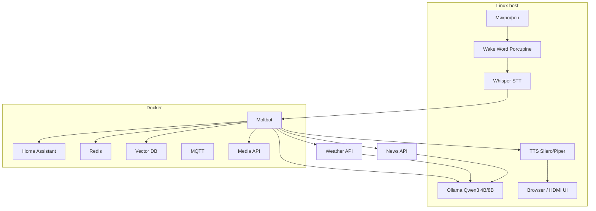

# План: сборка и отладка системы Moltbot-голосового хаба

## Целевая архитектура (из [context.md](context.md))

**Разделение:** в Docker — Moltbot, Home Assistant, Redis, Vector DB, MQTT, Media API; на хосте — wake word, Whisper, Ollama, TTS, браузер/UI (низкая задержка и доступ к железу). **Актуальные данные:** по интентам (погода, новости) Moltbot запрашивает внешние API, подставляет факты в контекст LLM, ответ — на русском (см. [context.md](context.md), раздел про погоду/новости и RU).

---

## Фаза 0: Подготовка окружения (личный ПК)

- **ОС:** Ubuntu 22.04/24.04 LTS или Fedora (как в контексте под AMD). На личном ПК — тот же дистрибутив, что планируется на mini PC.
- **Установить:** Docker + Docker Compose, Python 3.10+ (venv для скриптов хоста), порты: 11434 (Ollama), 8080/3000 (Moltbot/UI), 8123 (HA), 6379 (Redis) — не конфликтовать с существующими сервисами.
- **Проверить:** микрофон и вывод звука (ALSA/PulseAudio), при наличии — HDMI/второй дисплей для будущего UI.

---

## Фаза 1: Ядро — Ollama + Qwen3 (вне Docker)

- Установить Ollama нативно ([ollama.com](https://ollama.com)).
- Подтянуть модели: `qwen3:4b`, `qwen3:8b`. На AMD без стабильного ROCm — ориентир на CPU (AVX2); на личном ПК с другим GPU — по ситуации.
- Проверить: `curl http://localhost:11434/api/generate` с промптом, замерить задержку. Цель — быстрые ответы для 4B, приемлемые для 8B.
- Документировать в репо: команды установки и теста под ваш дистрибутив.

---

## Фаза 2: STT — Whisper (вне Docker)

- Развернуть Whisper large-v3 локально (Python: [openai/whisper](https://github.com/openai/whisper) или [ggerganov/whisper.cpp](https://github.com/ggerganov/whisper.cpp) для C++).
- Режим: поток с микрофона → фрагменты по ~5–30 сек → текст. На 7840HS/аналоге — realtime на CPU реалистичен.
- Сделать минимальный HTTP-сервис или CLI: аудио (файл/stream) → JSON с текстом, чтобы потом подключать к Moltbot по HTTP.
- Отладить качество и задержку на русском; при необходимости уменьшить модель (medium) для слабого ПК.

---

## Фаза 3: Moltbot + инфраструктура (Docker)

- Добавить в репо `docker-compose.yml` с сервисами:
  - **Moltbot** (официальный или совместимый образ; проверить [moltbot](https://moltbot.you/) / GitHub на актуальный способ запуска).
  - **Home Assistant** (официальный образ), **Redis**, **Vector DB** (Qdrant или Chroma), **MQTT** (e.g. Eclipse Mosquitto).
  - **Media Control API** — минимальный сервис-прослойка: принимает команды от Moltbot (REST/WebSocket), отдаёт команды браузеру/ Kodi (локальный хост или скрипты).
- Конфигурация Moltbot: endpoint Ollama `http://host.docker.internal:11434` (или IP хоста), Redis, Vector DB, опционально MQTT; интенты/скрипты для «включи свет», «запусти YouTube» и т.д.
- Поднять стек, проверить: запрос из Moltbot к Ollama, запись в Redis, вызов Home Assistant API (mock или тестовое устройство).

---

## Фаза 3b: Актуальные данные из интернета (погода, новости, RU)

- **Intent pipeline:** перед генерацией ответа по запросам типа «какая погода в Москве?» / «новости сегодня» вызывать внешние API, передавать сырые данные в LLM как fact context; LLM формирует ответ на русском.
- **Погода (Россия):** Yandex Weather API (Yandex Cloud Marketplace, ключ) — приоритет; fallback — OpenWeatherMap. Локаль `ru_RU`, города России. Кеш ответов 5–30 мин.
- **Новости (Россия):** News API (Google News Russia) — заголовки и краткие описания; фильтр по российским источникам. Кеш 5–30 мин.
- **Версии ПО / прочее:** при необходимости — отдельный интент с веб-поиском или специализированным API; промпт LLM — «отвечай на русском, используй только переданные факты».
- Хранить ключи (Yandex, News API) в переменных окружения или `config/` (не в репо); документировать в `docs/` получение ключей и формат ответов API.
- Проверить сценарии: «погода в Санкт-Петербурге», «последние новости России» — ответы актуальные и на русском.

### Отложено (backlog): универсальный web lookup

- Добавить безопасный инструмент “веб-поиск/чтение страницы” для общих вопросов типа «сколько зверей в зоопарке», «что такое X», «актуальная информация…».
- Режимы безопасности:
  - белый список доменов/источников (или хотя бы blacklist + ограничение по РФ/языку)
  - таймауты, кеширование, лимит длины контента
  - явная маркировка источников в ответе

---

## Фаза 4: Связка голос → Moltbot → ответ

- **Wake word:** Porcupine (или аналог) на хосте — при срабатывании запускать запись и передачу в Whisper. Режим «кнопка» для отладки допустим.
- Интеграция: микрофон → (опционально wake word) → Whisper → текст → HTTP в Moltbot → ответ LLM → возврат текста клиенту.
- Логировать запросы/ответы и тайминги; отладить стабильность и латентность на личном ПК.

---

## Фаза 5: TTS и вывод голоса

- Установить на хосте Silero TTS или Piper (русский голос). Обеспечить API или CLI: текст → WAV/stream → воспроизведение (ALSA/Pulse).
- Подключить к пайплайну: ответ Moltbot → TTS → динамики (и при необходимости вывод в тот же канал, что и HDMI).
- Довести задержку «ответ получен → начало речи» до приемлемой (в контексте указано &lt;300 ms как цель).

---

## Фаза 6: Медиа и HDMI UI (по аналогии с Android TV)

- **Медиа:** Media Control API в Docker отдаёт команды на хост (скрипты / локальный HTTP). На хосте: браузер (Chromium) fullscreen на HDMI, при необходимости Kodi + JSON-RPC или отдельные плееры.
- **HDMI UI:** приложение (Electron/Tauri или веб в kiosk) на хосте: распознанная фраза, ответ ассистента, статус умного дома, плеер. Автозапуск и fullscreen на HDMI.
- **Голос:** все сценарии управляются голосом через Moltbot («включи YouTube», «поставь трек …», «переключи на Первый канал» и т.д.).

### Варианты медиа-сервисов (набросок)

Цель — единая точка входа «как Android TV»: фильмы, стримы, ТВ, музыка; по возможности локальное время для ТВ, не только московское.

| Категория          | Источники / сервисы                                | Варианты реализации                                                                                                                                                                                                                                                                                                                                |
| ------------------ | -------------------------------------------------- | -------------------------------------------------------------------------------------------------------------------------------------------------------------------------------------------------------------------------------------------------------------------------------------------------------------------------------------------------- |
| **Фильмы/сериалы** | Локальная библиотека, стриминги, торренты          | **Kodi** (библиотека + дополнения) или **Jellyfin** / **Plex**; для торрентов — **qBittorrent** + **Jackett** (поиск) + **Jellyfin** с плагином или **Stremio**; альтернатива — **Radarr**/ **Sonarr** + плеер по выбору.                                                                                                                          |
| **YouTube**        | YouTube                                            | Браузер (Chromium) в kiosk на нужный URL; или **FreeTube** (десктоп), или встроенный в Kodi addon; голос: «открой ютуб» / «включи канал X».                                                                                                                                                                                                        |
| **VK Видео**       | vk.com/video                                       | Браузер на vk.com/video или клиент/виджет; голос: «включи вк видео» / «найди в вк …».                                                                                                                                                                                                                                                              |
| **Twitch**         | twitch.tv                                          | Браузер на twitch.tv или Kodi addon; голос: «открой твитч» / «включи стрим X».                                                                                                                                                                                                                                                                     |
| **Telegram-видео** | Telegram (каналы, сохранённое)                     | Через **Telegram Desktop** или веб в браузере; либо бот/API + локальный плеер (сложнее); голос: «покажи видео из телеграма» / «открой канал X».                                                                                                                                                                                                    |
| **ТВ (эфир)**      | Эфирное/кабельное, IPTV, интернет-каналы           | **TVHeadend** (DVB/IPTV) или **IPTV-плеер** (например в Kodi); **важно:** трансляция по локальному времени — настраивать таймзону в TVHeadend/приложении и при необходимости EPG по локальному времени (источники EPG с привязкой к региону). Избегать жёсткой привязки к московскому времени в UI/скриптах.                                       |
| **Музыка**         | VK Музыка, Spotify, локальная библиотека, торренты | **VK:** браузер на music.vk.com или неофициальный клиент, если есть. **Spotify:** браузер или **Spotifyd** + любой MPRIS-клиент. **Локальная библиотека:** Jellyfin/Plex/Kodi. **С торрентов:** скачивание через **Lidarr** (или ручной разбор) + библиотека в Jellyfin/Kodi; голос: «включи вк музыку», «поставь в спотифай …», «играй альбом X». |

**Общая схема управления голосом**

- Moltbot распознаёт интенты: «включи ютуб», «переключи на Первый», «поставь трек …», «пауза», «громче».
- Media Control API (или расширенный media-api в репо) маппит интенты в действия: открыть URL в браузере, отправить JSON-RPC в Kodi, вызвать MPRIS (пауза/громкость), переключить источник ТВ.
- На хосте: один или несколько целевых «плееров» (браузер, Kodi, TVHeadend frontend); API знает, куда слать команду.

**Рекомендуемый минимум для старта**

1. **Браузер (Chromium) в kiosk** — YouTube, VK видео, Twitch, Telegram (веб), Spotify/VK музыка (веб); управление голосом через «открой …» → подстановка URL.
2. **Kodi** — локальная библиотека фильмов/музыки, при необходимости IPTV + EPG; голос: «включи кино», «следующий трек», «переключи на канал X».
3. **ТВ по локальному времени** — при добавлении ТВ настроить таймзону и EPG под свой регион (не Москва по умолчанию).

Дальше по желанию: Stremio/Radarr/Sonarr/Lidarr, отдельные клиенты под VK/Spotify, Telegram Desktop как источник видео.

---

## Фаза 7: Умный дом (Home Assistant)

- В Docker уже поднят Home Assistant. Подключить реальные интеграции: Zigbee/Matter/MQTT/Wi‑Fi по наличию железа.
- В Moltbot прописать интенты и вызовы HA API (REST/WebSocket): свет, климат, шторы и т.д.
- Проверить сценарии голосом: «включи свет в гостиной», «температура 22» — отладка на личном ПК с тестовыми entity.

---

## Фаза 8: Файловое хранилище (аналог Google Drive / Яндекс.Диск)

- Поднять в docker-compose сервис файлового хранилища (например **Nextcloud** или **FileBrowser** / **Filestash** для лёгкого варианта): веб-интерфейс, синхронизация, общие папки.
- Настроить тома для данных и при необходимости бэкапы.

---

## Фаза 9: Фотохранилище (аналог Google Фото)

- Поднять в docker-compose сервис для фото (например **Immich**, **PhotoPrism** или **Pigallery2**): загрузка, теги, лица, поиск по дате/месту, веб-галерея.

---

## Фаза 10: GitLab и Runner

- Поднять в docker-compose **GitLab** (или Gitea + Drone для лёгкого варианта) и **GitLab Runner** для CI/CD: репозитории, пайплайны, сборка и деплой проектов из homelab.
- **Автообновление сервиса через GitLab CI/CD:** пайплайн в репозитории homelab при push в main (или при создании тега) запускается на Runner’е, имеющем доступ к серверу (тот же хост или SSH). Шаги: `git pull` (или клонирование артефакта), `docker compose pull`, `docker compose up -d` (с нужными профилями). Опционально: уведомление в Telegram/почту об успешном деплое или об ошибке. Секреты (путь к репо, SSH-ключ при деплое на другой хост) хранить в GitLab CI/CD Variables.

---

## Фаза 11: Сведение и отладка на личном ПК

- Собрать единый сценарий: wake word → запись → Whisper → Moltbot → Ollama/HA/Media → TTS → HDMI UI.
- Зафиксировать в репо: скрипты запуска (systemd units или скрипты), порядок старта сервисов, переменные окружения.
- Чек-лист: распознавание, ответ, HA, медиа, TTS, стабильность под нагрузкой.

---

## Фаза 12: Перенос на Mini PC (или другой целевой хост)

**Целевая спецификация (референс):** Mini PC на базе **AMD Ryzen AI 9 HX 370**, **32 ГБ DDR5**, графика **AMD Radeon 890M**, накопитель **NVMe M.2 256 или 512 ГБ** (система и приложения; данные Nextcloud/Immich — на внешнем хранилище или RAID по фазам 8–9 и docs/storage-raid.md).

- Перенести репо и конфиги на целевой Mini PC (тот же дистрибутив, что и на ПК для отладки).
- Подставить фактические параметры: IP, порты, пути к USB (Zigbee и т.д.), вывод HDMI.
- Повторить проверки (голос, медиа, HA, TTS). На данной платформе (Ryzen AI 9 HX 370, 32 ГБ, Radeon 890M) возможен запуск более тяжёлых моделей (Whisper large, Qwen3 8B и выше); при нехватке ресурсов — уменьшить до Whisper medium и Qwen3 4B.

---

## Артефакты в репозитории (предлагаемая структура)

- `docker-compose.yml` — Moltbot, HA, Redis, Vector DB, MQTT, Media API; фазы 8–10: файловое хранилище (Nextcloud/FileBrowser), фото (Immich/PhotoPrism), GitLab + Runner.
- `.gitlab-ci.yml` (или аналог) — пайплайн CI/CD: при push/tag — деплой на сервер (pull, docker compose up), автообновление homelab.
- `docs/` — установка Ollama/Whisper/TTS на хост, требования к ОС и железу.
- `scripts/` — запуск голосового контура (wake word + Whisper + вызов Moltbot), запуск TTS, медиа/HDMI.
- Конфиги Moltbot и HA (в `config/` или рядом с compose), примеры интентов; конфиг/env для API погоды и новостей (ключи — вне репо).
- Краткий README с порядком развёртывания и отладки по фазам.
- Документация по API: Yandex Weather, News API (Russia), кеширование и intent-маршрутизация в Moltbot.

---

## Тесты (pytest)

- Завести в репозитории тесты для ключевых сервисов, чтобы не забыть их дописать позже.
- **moltbot-api:** тесты для `GET /healthz`, `GET /v1/system/status`, `POST /v1/system/services` (с моками HTTP); при желании — `POST /v1/chat` с моками Ollama/Redis.
- **media-api (опционально):** тесты для healthz и вызова команды.
- **Структура:** каталог `moltbot_api/tests/` (или `tests/` в корне репо), зависимости `pytest`, при необходимости `pytest-asyncio` для async-эндпоинтов. В README или в этом плане — команда запуска: `pytest`.

---

## Кроссплатформенное приложение (Flutter)

Самостоятельное нативное приложение (не веб внутри оболочки): один код на **Flutter** (Dart) для всех платформ.

- **Платформы:** Android, iOS, Windows, macOS, Linux.
- **При первом запуске:** экран настройки — пользователь вводит IP сервера (и при необходимости порт). Адрес сохраняется в локальное хранилище (`shared_preferences` или аналог) и используется как base URL для всех запросов к API.
- **Функционал:** тот же, что у веб-UI Moltbot — чат с ассистентом, быстрые команды (чипы), дашборд сервисов, статусы; все вызовы к moltbot-api (`/api/v1/chat`, `/api/healthz`, `/api/v1/system/status`, `/api/v1/system/services` и т.д.) идут на сохранённый адрес (например `http://192.168.1.5:18080`).
- **Реализация:** один репозиторий Flutter (отдельно от homelab или подкаталог в репо), таргеты под iOS, Android, Windows, macOS, Linux. UI и логика — на Dart/Flutter, без WebView; HTTP-клиент (например `dio` или `http`) с подстановкой base URL из настроек.
- **Артефакты:** при добавлении в homelab — каталог `moltbot_app/` (или отдельный репозиторий), README со сборкой под каждую платформу (`flutter build apk`, `flutter build ios`, `flutter build windows` и т.д.). Опционально: пункт в общем README homelab со ссылкой на приложение и инструкцией «указать IP сервера при первом запуске».

---

## К проработке (backlog)

- **Автономное выполнение планов по коду:** реализовать оркестрацию кодовых агентов по зафиксированным решениям (см. секцию «Решения: платформа оркестрации кодовых агентов»). Изучить: какие API или сценарии доступны у редакторов и сервисов; нужен ли отдельный coding-агент с доступом к файлам и терминалу; как безопасно и контролируемо запускать такое выполнение.

---

## Решения: платформа оркестрации кодовых агентов

(По мотивам Vibecraft: гекс-карта сессий/агентов, оркестрация через Moltbot, взаимодействие с Claude для кода.)

1. **Claude Code** — без привязки к Cursor. Допустимые варианты: Claude API (Anthropic), IDE с Claude (любой редактор с плагином), terminal (например `claude` CLI). Для оркестрации предпочтителен Claude API: единый контракт, несколько агентов = несколько conversation_id, инструменты (read_file, run_cmd, grep) на своей стороне.
2. **Роль Moltbot** — оркестрация. Пользователь ставит задачу через платформу (чат/голос) → запрос в moltbot-api → Moltbot разбивает на подзадачи, создаёт/обновляет сессии (агентов), решает когда вызывать Claude API или свои инструменты → платформа отображает гекс-карту, список сессий, статусы и чат. Вся логика «кто что делает» — в Moltbot.
3. **Размещение платформы:** пока — отдельная платформа (отдельный репо или каталог в homelab) для доработки и отладки самого homelab. В дальнейшем — сделать частью homelab для работы с другими проектами: тот же UI и протокол оркестрации, добавление концепции «проект» (корень репо), оркестратор и инструменты работают с выбранным проектом; при необходимости — вынести платформу в docker-compose рядом с moltbot-ui.

---

## Риски и упрощения

- **Ollama на AMD:** при нестабильном ROCm держать CPU; Qwen3 4B/8B на CPU на 7840HS по контексту приемлемы.
- **Moltbot:** актуальный способ деплоя (образ/сборка из исходников) уточнить по официальному репозиторию; при отсутствии готового образа — описать сборку своего.
- **Безопасность:** ограничить доступ к Moltbot и HA (firewall, не светить наружу без необходимости); при необходимости — whitelist команд и гостевой режим, как в контексте.
- **Погода/новости:** ключи Yandex и News API хранить в env; учитывать квоты и лимиты; кеш 5–30 мин снижает число запросов.

После выполнения плана у вас будет воспроизводимая система «голосовой хаб» на личном ПК и готовая конфигурация для развёртывания на Mini PC с похожими характеристиками.

---

## Монетизация (идеи)

Продаётся продукт «Homelab Pack» (сборка: конфиги, скрипты, документация, образы), а не открытые компоненты (Moltbot, Immich и т.д.) — их лицензии сохраняются.

### Модели лицензий

| Модель          | Описание                                                                                                                       |
| --------------- | ------------------------------------------------------------------------------------------------------------------------------ |
| **Базовая**     | Разовая покупка: доступ к текущей версии (архив/снапшот репо), без последующих обновлений.                                     |
| **Продвинутая** | Разовая покупка с правом получать обновления — явно оговорить срок (например 1 год) или «пожизненно».                          |
| **Подписка**    | Ежемесячная/ежегодная оплата: доступ к обновлениям на срок подписки (приватный репо, новые теги, образы). Предсказуемый доход. |

Рекомендация: **базовая** (разово, без обновлений) + **подписка** (обновления на 1 год) — проще объяснить и привязать технически доступ к обновлениям к подписке.

### Реализация

- **Доступ к обновлениям:** приватный репозиторий (GitLab/GitHub); подписчики — доступ в репо или к тегам/релизам; базовая — одноразовая выдача архива/тега.
- **Лицензионные ключи (опционально):** ключ с подписью (HMAC/Ed25519), в ключе — тип лицензии и срок подписки; проверка в скрипте или в веб-панели; хранение в `.env` (`HOMELAB_LICENSE_KEY`).
- **Оплата:** ЮKassa / Tinkoff (РФ), Stripe / Paddle (мир), Gumroad / Lemon Squeezy (приём + выдача ссылок/ключей). Подписка — рекуррентный платёж, в вебхуке продлевать доступ или выдавать ключ.
- **Артефакты:** `docs/monetization.md` (детализация моделей и шагов), при необходимости — скрипт проверки лицензии и формат ключа.

