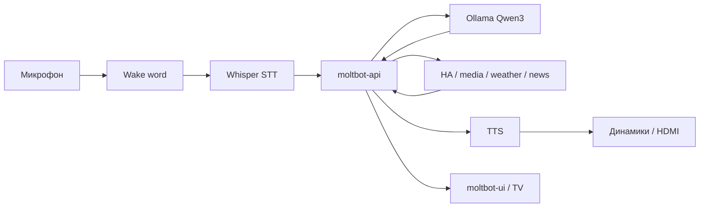

# Архитектура homelab

Домашний голосовой хаб: ассистент с локальной LLM, умный дом, медиа на HDMI и серверные сервисы на одной машине. Целевая платформа — mini PC **AMD Ryzen AI 9 HX 370**, **Radeon 890M**, **32 GB RAM**; подробнее о выборе ОС и железа — [platform.md](./platform.md).

## Три роли одной машины

Одно устройство закрывает три задачи, которые обычно разносят по разным коробкам:

| Роль | Примеры |
|------|---------|
| Умная станция | голосовой диалог, wake word, ответы на русском |
| Медиацентр | Kodi, Stremio, браузер на HDMI → ТВ |
| Homelab-сервер | Docker-сервисы, API, хранилища, CI |

Репозиторий `homelab` — **верхний уровень управления**: `docker-compose.yml`, конфиги, скрипты хоста, документация. Ubuntu занимается железом и desktop, Docker — сервисами.

## Слои на хосте

```text
┌──────────────────────────────────────────────┐
│           Ubuntu 26.04 LTS Desktop           │
│                                              │
│  ┌──────────────┐    ┌──────────────────┐   │
│  │ Steam/Proton │    │ Docker Compose   │   │
│  │ Kodi/Stremio │    │ moltbot-api, HA, │   │
│  │ браузер/TV UI│    │ Redis, media-api │   │
│  └──────────────┘    │ Nextcloud, …     │   │
│                      └──────────────────┘   │
│  Ollama (Qwen3) · Whisper · TTS · executor  │
│                      ↓                       │
│              Radeon 890M (shared RAM)        │
└──────────────────────────────────────────────┘
                        │
                   HDMI → ТВ
```

Три логических контура поверх одной ОС:

```text
         ┌─────────────────┐
         │ Ubuntu Desktop  │
         └────────┬────────┘
                  │
    ┌─────────────┼─────────────┐
    ↓             ↓             ↓
 Gaming        Homelab          AI
 Steam/Proton  Docker Compose   Ollama
 Kodi/Stremio  moltbot-api      Whisper
 браузер       HA, Redis, …     TTS
    │             │             │
    └─────────────┴─────────────┘
                  ↓
           TV / LAN / Internet
```

## Docker vs host

**Принцип:** в Docker — stateless HTTP/WebSocket-сервисы без прямого доступа к аудио, GPU и HDMI. На хосте — всё, что требует низкой задержки и железа.

| На хосте (вне Docker) | В Docker |
|----------------------|----------|
| Ollama (`qwen3:4b`, `qwen3:8b`) | `moltbot-api` — оркестратор, интенты, tools |
| Whisper STT (`whisper-server`, systemd) | Redis, Qdrant, MQTT |
| TTS (Silero / Piper) | `media-api` |
| Wake word (Porcupine / OpenWakeWord) | Home Assistant (профиль `ha`) |
| Media executor (браузер, Kodi, MPRIS) | Nextcloud, Immich, GitLab, SearxNG, qBittorrent (профили) |
| Kodi, Stremio, Chromium на HDMI | `moltbot-ui` |

Ollama **не** заворачивают в Docker на desktop/Linux: на iGPU с shared RAM выигрывает нативный доступ к CPU и памяти.

Связь между слоями — HTTP/WebSocket/MQTT:

- STT → `moltbot-api` (`http://localhost:18080`)
- `moltbot-api` → Ollama (`http://host.docker.internal:11434`)
- `moltbot-api` → Home Assistant, `media-api`, внешние API погоды/новостей
- `media-api` → executor на хосте (`MEDIA_EXECUTOR_URL`)

## Голосовой контур



1. **Wake word** (опционально) или push-to-talk — см. [voice-mvp.md](./voice-mvp.md), [wake-word.md](./wake-word.md).
2. **STT** — `whisper-server` на хосте, модель держится в памяти (systemd).
3. **moltbot-api** — маршрутизация: быстрые команды (`qwen3:4b`), диалог (`qwen3:8b`), детерминированные tools без LLM (пауза, свет).
4. **Актуальные данные** — погода, новости, web-search подставляются как fact context перед генерацией; см. [web-search.md](./web-search.md), переменные в `.env`.
5. **TTS** — Silero/Piper на хосте, вывод в колонки или HDMI.
6. **Медиа** — голос → `media-api` → executor открывает URL в браузере или управляет Kodi/Stremio; см. [media-control.md](./media-control.md), [torrents.md](./torrents.md).

## Порядок загрузки

Сервисы Docker стартуют через systemd **независимо** от входа в графическую сессию:

```text
BIOS → Ubuntu → systemd → docker.service → docker compose up
                                              ↓
                                    moltbot-api, Redis, …
```

Пользователь может позже открыть Steam, Kodi или браузер — homelab уже работает.

Рекомендуется включить автозапуск compose (unit или `@reboot` в cron) и host-сервисов (`whisper-server`, `timer-worker` и т.д.) — см. `scripts/systemd/`.

## Режимы использования ресурсов

На **32 GB shared RAM** LLM, Docker, desktop и игры делят одну память. iGPU Radeon 890M тоже использует системную RAM — VM и GPU passthrough для LLM не применяются.

Управление без отдельных физических разделов:

| Режим | LLM | Docker | Desktop / GPU |
|-------|-----|--------|----------------|
| **AI** | активен, `qwen3:8b` по необходимости | базовые сервисы | минимум |
| **Gaming** | выгрузить модель (`ollama stop`) или только `4b` | лимиты памяти контейнеров | Steam/Proton, приоритет GPU |
| **Media** | `4b` или пауза inference | базовые контейнеры | Kodi/Stremio/браузер на HDMI |

Практические приёмы:

- `docker update --memory` для тяжёлых профилей (`gitlab`, `photos`) перед игрой.
- `OLLAMA_MODEL_FAST` / `OLLAMA_MODEL_CHAT` в `.env` — роутинг 4B vs 8B.
- `systemctl stop whisper-server` при нехватке RAM (голос временно через push-to-talk в UI).
- Не резервировать половину RAM под LLM статически — держать модели загруженными только когда нужны.

## Почему не Proxmox и не VM для LLM

Для сценария «игровой ПК + медиастанция + AI + сервер» на одном mini PC с iGPU:

- **Proxmox / гипервизор** добавляет overhead и усложняет passthrough iGPU (нестабильно на AMD iGPU).
- **Отдельная VM под LLM** ухудшает доступ к shared memory и bandwidth — критично для inference.
- **Bare-metal Ubuntu Desktop** даёт прямой доступ: `amdgpu`/Mesa, Vulkan, Wayland/X11, Steam, HDMI.

Proxmox уместен для чистого homelab без игр и без LLM на том же железе; для этой конфигурации — избыточен.

## Медиа: Kodi и Stremio

В проекте медиа строится на **хосте**, не в Docker:

- **Kodi** — локальная библиотека, IPTV, источник из папки загрузок qBittorrent.
- **Stremio** — стриминги и торрент-контент через addons; голосом через `media-api` и executor.
- **Браузер (Chromium)** — YouTube, VK, Netflix и другие сервисы с DRM.

Подробности: [media-control.md](./media-control.md), [torrents.md](./torrents.md).

## Профили Docker Compose

Базовый стек (`docker compose up -d`): Redis, Qdrant, MQTT, `moltbot-api`, `media-api`, `moltbot-ui`.

Опциональные профили (включаются по необходимости):

| Профиль | Сервисы | Документация |
|---------|---------|--------------|
| `ha` | Home Assistant | [home-assistant.md](./home-assistant.md) |
| `storage` | Nextcloud | [file-storage.md](./file-storage.md) |
| `photos` | Immich | [photos-storage.md](./photos-storage.md) |
| `gitlab` | GitLab + Runner | [gitlab-migration.md](./gitlab-migration.md) |
| `torrents` | qBittorrent | [torrents.md](./torrents.md) |
| `search` | SearxNG | [web-search.md](./web-search.md) |

## Надёжность и хранение

- Данные на RAID / внешних дисках — [storage-raid.md](./storage-raid.md), `docker-compose.raid.example.yml`.
- Резервное копирование — [backup.md](./backup.md), `scripts/backup.sh`, `scripts/systemd/homelab-backup.timer`.

## Связанные документы

- [platform.md](./platform.md) — выбор Ubuntu 26.04 Desktop, железо, установка.
- [voice-mvp.md](./voice-mvp.md) — голосовой MVP на хосте.
- [../README.md](../README.md) — быстрый старт и curl-примеры.
- [../context.md](../context.md) — исходный контекст проекта и обсуждение с ChatGPT.
